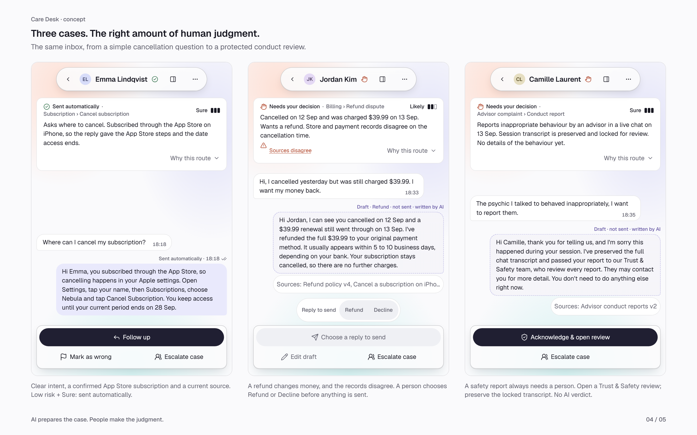

# Slide exports

All PNGs are 2880 × 1800 pixels: a 1440 × 900 canvas captured at 2× density.
Each file has a `-night.png` counterpart.

| File | Content |
| --- | --- |
| `s2-flow.png` | Jordan's path from incoming message through rules, decision, Undo and quality |
| `s3-inbox.png` | The inbox with Jordan Kim open |
| `s4-cases.png` | Emma, Jordan and Camille, using real mobile components and fixtures |
| `s5-safeguards.png` | Marcus's expanded routing evidence and Camille's Trust & Safety handoff |
| `s5-metrics.png` | The quality sheet, with auto-resolution paired with reopens |
| `s5-bulk-preview.png` | The bulk approval preview |

Run `npm run capture:slides` with the desk running at `http://localhost:3000`.
`scripts/plans/make-slides.mjs` regenerates the capture plan, including the required clicks and keys.
Set `CAPTURE_BASE_URL` to capture another local server. The capture rejects an overflowing export canvas.

The three-case route uses isolated same-origin frames, so responsive layout, local state, keyboard
handling and popover portals remain those of the actual desk. Only that presentation omits processing
logs and shows one draft variant at a time. The Refund / Decline controls still require a deliberate
choice before sending; the initial Refund preview is not a selected decision.

